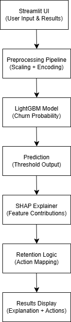
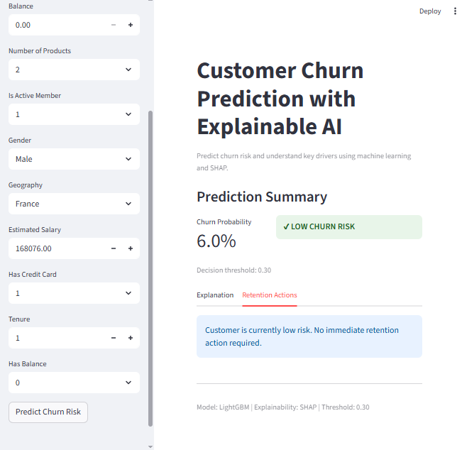
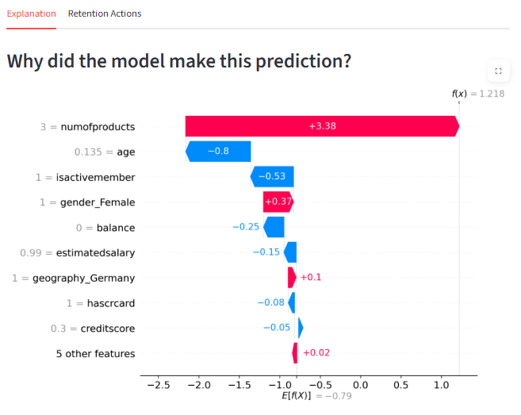
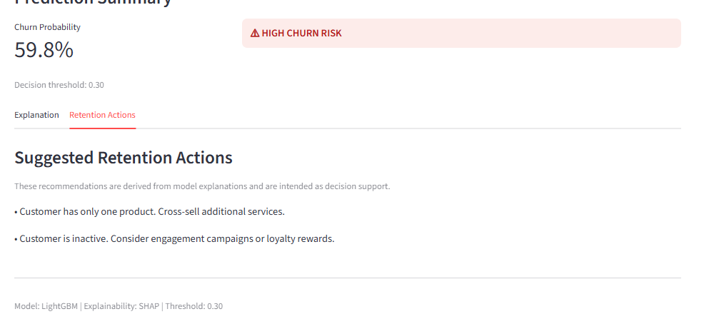

# Customer Churn Prediction with Explainable AI

Predicting customer churn using LightGBM with SHAP-based global and local explanations, and translating model insights into actionable retention strategies.

## Problem Statement
Customer churn is a critical challenge for subscription-based businesses, where retaining existing customers is often more cost-effective than acquiring new ones. Traditional churn prediction models focus primarily on accuracy, offering limited transparency into why a customer is predicted to churn.

The objective of this project is not only to predict customer churn accurately, but also to make the predictions explainable and actionable. By combining a high-performing machine learning model with Explainable AI techniques, this project aims to support informed business decisions rather than black-box predictions.

## Dataset Overview
The dataset contains customer demographic, account, and behavioral information, including:

- Customer profile: age, gender, geography
- Account details: tenure, credit score, credit card ownership
- Product usage: number of products, account activity status
- Financial information: balance, estimated salary
- Target variable: churn indicator (Exited)

The target variable is highly imbalanced, with significantly fewer churned customers compared to retained customers. This imbalance was explicitly considered during model evaluation and threshold selection.

## Approach & Methodology

The project follows an end-to-end machine learning workflow:

1. Exploratory Data Analysis (EDA) to understand feature distributions, outliers, and churn patterns
2. Feature engineering, including the creation of derived features such as balance presence
3. Training and comparison of multiple models:
   - Random Forest
   - XGBoost
   - LightGBM
   - Voting Classifier
4. Model evaluation using churn-focused metrics rather than accuracy alone
5. Selection of LightGBM as the final model based on performance and interpretability
6. Explainability using SHAP for both global and local model understanding
7. Translation of model explanations into customer-level retention recommendations

## Model Selection & Evaluation

Model performance was evaluated using metrics aligned with the business objective of identifying churners:

- ROC-AUC
- Precision-Recall AUC
- Recall for churned customers
- False positives and false negatives at a chosen decision threshold

Given the imbalanced nature of the dataset, a probability threshold of 0.30 was selected to prioritize recall of churned customers. LightGBM provided the best balance between recall, stability, and explainability.

Hyperparameter tuning using Optuna was explored, but the baseline LightGBM model achieved comparable performance, leading to the selection of the baseline model for deployment.

## Explainable AI with SHAP
To ensure transparency and trust in model predictions, SHAP (SHapley Additive exPlanations) was used for explainability.

Global explainability:
- SHAP bar plots to identify the most influential features overall
- SHAP summary (beeswarm) plots to understand feature impact and direction

Local explainability:
- SHAP waterfall plots to explain individual customer predictions
- Decision plots to visualize how multiple features combine to influence risk

These explanations revealed that churn is primarily driven by customer engagement and lifecycle factors such as number of products, activity status, and age, rather than purely financial variables.

## Personalized Retention Strategy
Beyond explanation, SHAP values were used to derive personalized retention strategies.

For customers identified as high risk:
- The top positive SHAP contributors were extracted
- Each contributor was mapped to a business-oriented retention action
- Recommendations are presented as decision support rather than automated actions

This approach enables stakeholders to understand not only who is at risk of churning, but also why and how intervention strategies can be tailored at the customer level.

## Streamlit Application

An interactive Streamlit application was developed to demonstrate real-time inference and explainability.

The application allows users to:
- Input customer details
- View churn probability and risk classification
- Understand the prediction through SHAP waterfall explanations
- Receive personalized retention recommendations for high-risk customers

The application loads pre-trained artifacts and applies consistent preprocessing to ensure reliability between training and inference.

## System Architecture

The diagram below illustrates the end-to-end architecture of the churn prediction and explainability system.

The application follows a decision-support pipeline where user inputs are preprocessed, passed through a trained LightGBM model, and explained using SHAP. Model explanations are further translated into personalized retention recommendations and displayed through a Streamlit interface.

## From Explainability to Retention Strategy

The diagram below shows how model predictions are translated into actionable business insights.

SHAP values are used to identify the most influential features driving churn risk. These risk drivers are then interpreted and mapped to predefined retention strategies, enabling transparent and actionable decision support.

## Project Structure

Customer_Churn_ExplainableAI/
│
├── assets/
│   ├── architecture.png
│   ├── explainability_flow.png
|   └── screenshots/
│       ├── app_home.png
|       ├── high_risk_prediction.png
|       ├── shap_explanation.png
|       └── retention_actions.png
|
├── churn_app/
│   ├── artifacts/
│   │   ├── config.json
│   │   ├── feature_names.pkl
│   │   ├── model.pkl
│   │   └── preprocessor.pkl
│   │
│   ├── explainability/
│   │   ├── retention_logic.py
│   │   └── shap_explainer.py
│   │
│   ├── inference/
│   │   ├── predict.py
│   │   └── preprocess.py
│   │
│   ├── ui/
│   │   └── input_form.py
│   │
│   └── app.py
│
├── data/
├── notebooks/
├── README.md
├── requirements.txt
└── .gitignore

## Application Demo

### Streamlit Interface
The application provides an interactive interface for churn prediction, explainability, and retention planning.

#### App Home

#### High-Risk Prediction Example

#### Low-Risk Prediction Example

#### SHAP-Based Explanation

#### Personalized Retention Actions

## Results & Key Insights

- Customer engagement features dominate churn prediction more than financial attributes
- Single-product and inactive customers are at significantly higher churn risk
- Explainable AI enables identification of false positives and overestimated risk cases
- Translating model explanations into retention actions bridges the gap between ML and business decisions

## Limitations & Future Work

- Retention recommendations are rule-based and not optimized for cost-benefit trade-offs
- The current application supports single-customer inference rather than batch processing
- Future extensions could include API-based deployment, monitoring, and automated policy optimization

## How to Run the App

1. Clone the repository
2. Install dependencies:
   pip install -r requirements.txt
3. Navigate to the Streamlit app directory:
   cd churn_app
4. Run the application:
   streamlit run app.py

