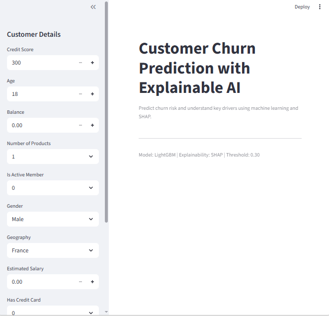
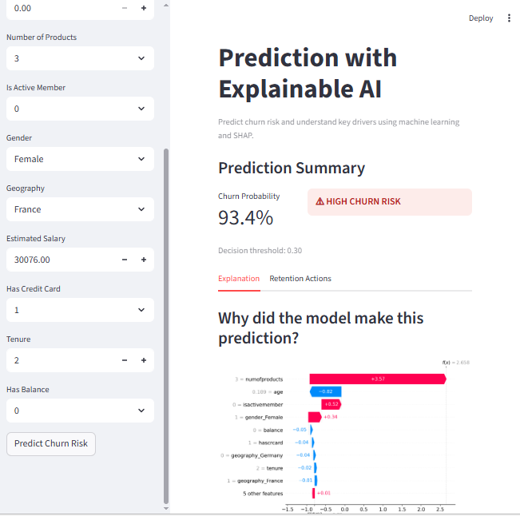
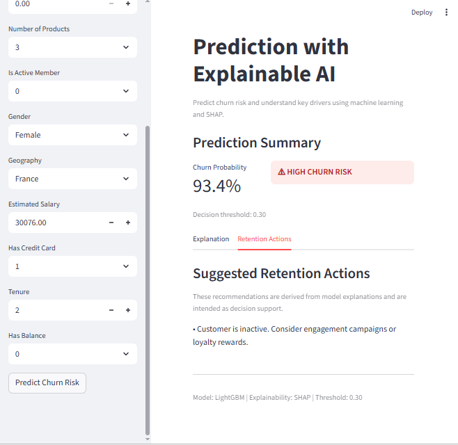
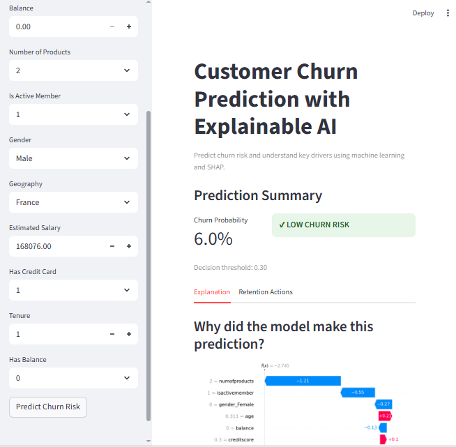

# Explainable Customer Churn Prediction with SHAP and Retention Strategy Engine

<div align="center">

[](https://python.org)
[](https://lightgbm.readthedocs.io)
[](https://shap.readthedocs.io)
[](https://streamlit.io)
[](https://hub.docker.com/r/datadoodle14/customer-churn)
[](https://hub.docker.com/r/datadoodle14/customer-churn)

> Predict **who will churn**, explain **why**, and recommend **what to do about it**.

</div>

---

# 📌 Table of Contents

* [Problem Statement](#problem-statement)
* [Project Highlights](#project-highlights)
* [System Architecture](#system-architecture)
* [ML Pipeline Overview](#ml-pipeline-overview)
* [Tech Stack](#tech-stack)
* [Model Artifacts](#model-artifacts)
* [Project Structure](#project-structure)
* [How to Run](#how-to-run)
* [Model Performance](#model-performance)
* [App Walkthrough](#app-walkthrough)
* [Key Insights](#key-insights)
* [Future Work](#future-work)

---

# Problem Statement

Customer churn is a critical challenge for subscription-based businesses.
Retaining existing customers is often **far cheaper than acquiring new ones**, yet most churn prediction systems only answer:

> *Will this customer churn?*

This project goes further and answers **three business-critical questions**:

| Question                      | Answer Provided                         |
| ----------------------------- | --------------------------------------- |
| Will this customer churn?     | Churn probability + risk classification |
| Why are they likely to churn? | SHAP-based explanation                  |
| What should we do about it?   | Personalized retention strategies       |

---

# Project Highlights

✔ End-to-end ML pipeline from **EDA → training → explainability → deployment**  
✔ **Explainable AI using SHAP** for global and local model interpretation  
✔ **Retention strategy engine** translating SHAP insights into business actions  
✔ **Interactive Streamlit dashboard** for real-time predictions  
✔ **Dockerized deployment** for reproducibility and portability  

---

# System Architecture

```
User Input (Streamlit UI)
        │
        ▼
Preprocessing Pipeline
        │
        ▼
LightGBM Model
        │
        ▼
SHAP Explainer
        │
   ┌────┴────┐
   ▼         ▼
Churn     Retention
Score     Strategy
   │         │
   └────┬────┘
        ▼
  Streamlit Dashboard
```

---

# ML Pipeline Overview

```
Data Collection
      ↓
Data Preprocessing
      ↓
Feature Engineering
      ↓
Model Training
(Random Forest / XGBoost / LightGBM)
      ↓
Model Evaluation
      ↓
Explainability (SHAP)
      ↓
Retention Strategy Engine
      ↓
Streamlit Application
```

This pipeline ensures predictions remain **interpretable, reliable, and actionable for business stakeholders**.

---

# Tech Stack

| Category              | Tools                             |
| --------------------- | --------------------------------- |
| Language              | Python 3.11                       |
| ML Models             | LightGBM, Random Forest, XGBoost  |
| Explainability        | SHAP                              |
| Hyperparameter Tuning | Optuna                            |
| Data Processing       | Pandas, NumPy, Scikit-learn       |
| Visualization         | Matplotlib, Seaborn               |
| Frontend              | Streamlit                         |
| Containerization      | Docker                            |

---

# Model Artifacts

The Streamlit application loads pre-trained artifacts generated during the training phase.

| Artifact            | Description                                 |
| ------------------- | ------------------------------------------- |
| `model.pkl`         | Trained LightGBM model                      |
| `preprocessor.pkl`  | Preprocessing pipeline used during training |
| `feature_names.pkl` | Feature ordering required for inference     |
| `config.json`       | Model threshold and configuration           |

These artifacts ensure the **inference pipeline matches the training pipeline exactly**, preventing feature mismatch errors.

---

# Project Structure

```
Customer_Churn_ExplainableAI/
│
├── assets/
│   ├── explainability_flow.png
│   └── screenshots/
│
├── churn_app/
│   ├── artifacts/
│   │   ├── config.json
│   │   ├── feature_names.pkl
│   │   ├── model.pkl
│   │   └── preprocessor.pkl
│   │
│   ├── explainability/
│   │   ├── retention_logic.py
│   │   └── shap_explainer.py
│   │
│   ├── inference/
│   │   ├── predict.py
│   │   └── preprocess.py
│   │
│   ├── ui/
│   │   └── input_form.py
│   │
│   └── app.py
│
├── notebooks/
├── data/
├── Dockerfile
├── .dockerignore
├── requirements.txt
├── .gitignore
└── README.md
```

---

# How to Run

## Option 1 — Docker Hub (Easiest — No Setup Needed!)

```bash
# Pull the image directly from Docker Hub
docker pull datadoodle14/customer-churn

# Run the app
docker run -p 8501:8501 datadoodle14/customer-churn
```

Open the app at `http://localhost:8501`

> 🐳 Docker image available at: [hub.docker.com/r/datadoodle14/customer-churn](https://hub.docker.com/r/datadoodle14/customer-churn)

---

## Option 2 — Build from Source

```bash
git clone https://github.com/DataDoodle14/customer-churn-explainableai.git
cd customer-churn-explainableai

docker build -t datadoodle14/customer-churn .
docker run -p 8501:8501 datadoodle14/customer-churn
```

---

## Option 3 — Run Locally (No Docker)

```bash
git clone https://github.com/DataDoodle14/customer-churn-explainableai.git
cd customer-churn-explainableai

pip install -r requirements.txt

streamlit run churn_app/app.py
```

---

# Model Performance

| Model         | ROC-AUC  | PR-AUC   | Recall   |
| ------------- | -------- | -------- | -------- |
| Random Forest | 0.86     | 0.61     | 0.72     |
| XGBoost       | 0.87     | 0.63     | 0.74     |
| **LightGBM**  | **0.88** | **0.65** | **0.76** |

**Why LightGBM?**

Best trade-off between:

* Recall
* PR-AUC
* Training speed
* SHAP compatibility

The decision threshold was set to **0.30** to capture more churners.

---

# App Walkthrough

### Input Customer Details


### High-Risk Prediction


### Retention Strategy


### Low-Risk Prediction


---

# Key Insights

* **Customer engagement features dominate churn prediction**
* **Single-product customers show significantly higher churn**
* **Inactive customers are the highest risk group**
* Explainable AI enables identification of **false positives and overestimated risk**

These insights help transform **model predictions into business decisions**.

---

# Future Work

* Batch prediction (upload CSV)
* FastAPI backend for production deployment
* MLflow experiment tracking
* Cost-sensitive churn optimization
* Automated retraining with drift detection

---

# Author

**Krutika Malli**  
GitHub: [github.com/DataDoodle14](https://github.com/DataDoodle14)

---

# License

This project is licensed under the **MIT License**.